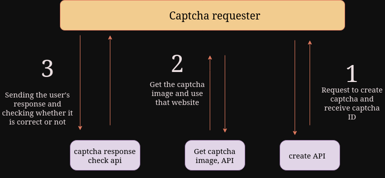

# Tori-captcha (a captcha system)
A captcha system that people can register in and use to create captchas on their own websites. Also, people can check the captcha answer through APIs.
# Technologies used


# how does it work?
In this system, first people who need captcha register on the website and receive a token, then, using it, they call an api that creates a captcha randomly and sends the ID of that captcha as an output.
By using the ID that they received in the captcha creation stage, they can receive the captcha image and then send the user answer to another api, and if the answer is correct, they will get the correct answer.



# Document
**To view the document, go to the `/docs` or `/redoc` path after running the project**

#

# How to run the project?
## Manualy
> This method is not suitable for production (Because of the last step)
```bash
# clone the project
git clone https://github.com/TorhamDev/Tori-captcha.git

cd Tori-captcha

# Install dependencies 
pip install -r requirements.txt

# run project
uvicorn main:app --reload
```

# License
[](./LICENSE)